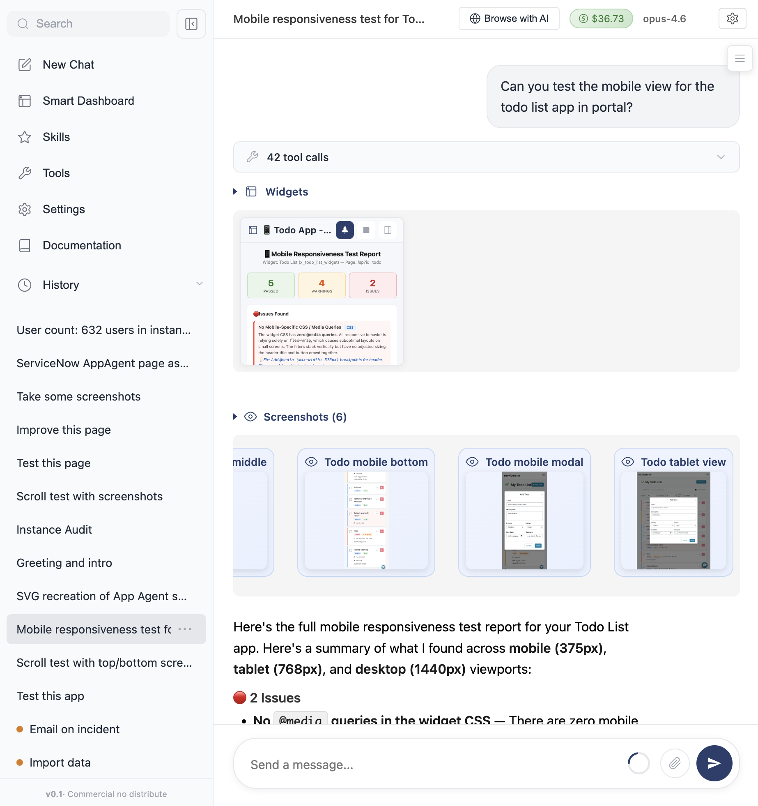

# AppAgent

**Build and maintain ServiceNow apps using an Agent. As a Chrome extension.**

AppAgent is your development partner for ServiceNow. It can create and maintain apps, and run tests for them. It does the testing by filling forms and taking screenshots. No technical knowledge required.

You bring your own API key (BYOK) and that's it! It's compatible with OpenAI, OpenRouter, Claude API, and even Claude Code plans (contact us privately).

It is a Chrome extension that stores all of the chat in your browser (does not even leave your browser). It only interacts with your ServiceNow instance and your model API provider.



It uses fewer tokens than Claude Code, as it leans heavily on API cache, tools caching and tool chaining (Out of the Box).

You can add skills to it, it has browser control via tabs, and it has mechanical undo buttons for all the changes it does to your instance.

> **Note:** For now, AppAgent is intended for use in development instances only.

## Contact Us

Please fill this form and we will reach out: [Contact Us Form](https://forms.gle/wP7CZjRJDMgQnGV9A)

## Features

| Feature | What It Does |
|---------|--------------|
| **Bring Your Own Model** | Choose from Claude, GPT, Gemini, Grok, and more |
| **Sign in with Claude** | OAuth flow — use your existing Claude Code Personal or Enterprise plan, no API key needed |
| **Images & PDFs** | Attach screenshots, diagrams, or documents for the Agent to analyze |
| **Code Editing** | Reads and modifies scripts with full version tracking |
| **Browser Control** | Tests its own work: Navigates tabs, clicks, fills forms, takes screenshots |
| **Live Dashboards** | Creates widgets that pull real-time data from your instance |
| **Agent Skills** | Build your own skills to extend the Agent's capabilities |
| **Skill Actions** | Skills can surface one-click buttons on the home page that trigger preset workflows |
| **Live Progress** | See what the Agent is doing in real time — mutating progress pills with running/stuck/done/error states |
| **Workspaces** | Per-chat file scratchpad — clone GitHub repos, read, write, edit, diff, and switch branches. Multi-repo per chat, with cross-chat ownership protection |
| **Integrated Git & GitHub Push** | The Agent can pull from / push to GitHub, raise branches, and open pull requests directly from the chat — no terminal, no IDE |
| **Smart Documents** | Persistent, versioned markdown the Agent can edit and reference across chats |
| **Multi-Instance** | Connect multiple ServiceNow instances; the Agent can see and act on all of them from one chat |
| **Pause & Interrupt** | Pause or send a new message mid-stream — the in-flight call aborts immediately |
| **Web Search** | Free, keyless web lookups via Google and DuckDuckGo |
| **Mechanical Undo** | Every change tracked, one-click rollback |
| **Export to XML** | Export all changes for deployment to other instances |
| **Tool Permissions** | Built-in security, control what the Agent can do on the instance |
| **Open Standards** | Compatible with [OpenRouter](https://openrouter.ai) and [AgentSkills.io](https://agentskills.io) |
| **Model Caching** | Reduces cost by up to 10x through prompt caching |
| **Smart Context** | Only loads needed parts of large files. Won't overload the model |
| **Zero Dependencies** | No libraries, no frameworks, pure vanilla JS |

## How It Works

```
┌──────────────┐      ┌──────────────┐      ┌──────────────┐
│              │      │              │      │              │
│   Chrome     │◀────▶│    Model     │      │  ServiceNow  │
│  Extension   │      │   (Claude,   │      │   Instance   │
│              │      │   GPT, etc)  │      │              │
│  [AppAgent]  │      └──────────────┘      │              │
│              │◀──────────────────────────▶│              │
└──────────────┘                            └──────────────┘
```

AppAgent is a Chrome extension with a built-in agent loop. You describe what you want → The Agent asks the model → Executes tools in the browser → Accesses ServiceNow with your current user permissions. The Agent talks directly to model API providers, on-premises or online.

## How AppAgent Compares

| | AppAgent | Claude Code | Cursor | Base44 |
|---|---|---|---|---|
| **Target user** | Non-technical | Developers | Developers | Non-technical founders |
| **Built for ServiceNow** | ✓ | ✗ | ✗ | ✗ |
| **Agentic ServiceNow actions** | ✓ | ✓ | ✗ | ✗ |
| **Dev environment needed** | ✗ | ✓ | ✓ | ✗ |
| **Builds apps** | ✓ | ✓ | ✓ | ✓ |
| **Browser control for testing** | ✓ | ✗ | ✗ | ✗ |
| **Takes screenshots** | ✓ | ✗ | ✗ | ✗ |
| **Background tasks** | ✓ (via Skill Actions) | ✗ | ✓ | ✗ |
| **Parallel agents** | Roadmap | ✗ | ✓ | ✗ |
| **Mechanical undo** | ✓ | ✗ | ✗ | ✗ |
| **Images & PDFs** | ✓ | ✓ | ✓ | Limited |
| **Smart Dashboards** | ✓ | ✗ | ✗ | ✓ |
| **Extensible Skills** | ✓ | ✓ | ✗ | ✗ |
| **Skill Actions (one-click buttons)** | ✓ | ✗ | ✗ | ✗ |
| **Live Progress Pills** | ✓ | ✗ | ✗ | ✗ |
| **Multi-instance support** | ✓ | ✗ | ✗ | ✗ |
| **Per-chat Workspaces** | ✓ | ✗ | ✗ | ✗ |
| **Integrated git** | ✓ | ✓ (CLI) | ✓ (IDE) | ✗ |
| **Push to GitHub from chat** | ✓ | ✓ (CLI) | Limited | ✗ |
| **Smart Documents** | ✓ | ✗ | ✗ | ✗ |
| **Pause / Interrupt mid-stream** | ✓ | ✓ | Limited | ✗ |
| **Web Search** | ✓ | ✓ | ✓ | ✗ |
| **Tool Permissions** | ✓ | ✓ | Limited | ✗ |
| **Export changes** | ✓ XML | ✓ | ✓ | ✓ |
| **Bring your own model** | ✓ | ✗ | ✓ | ✗ |
| **Prompt Caching** | ✓ | ✓ | ✓ | ✗ |
| **Smart Context** | ✓ | ✓ | ✓ | ✗ |
| **Zero Dependencies** | ✓ | ✗ | ✗ | ✓ |

*Base44 cannot build ServiceNow apps, but is included for users familiar with its experience.*

## Setup

1. **Install** — Install the AppAgent extension from the Chrome Web Store (or load unpacked for development)
2. **Get an API Key** — Sign up at [OpenRouter](https://openrouter.ai), use Anthropic/OpenAI directly, or connect your Claude Code subscription (Enterprise or Personal)
3. **Configure** — Open the extension, paste your API key in Settings
4. **Start Building** — Navigate to your ServiceNow instance and start chatting

## Examples

### "Build me a simple app to track team tasks"
AppAgent will create the table, add the fields, build a form and list layout, and set up a module in the navigator. One prompt, full app.

### "Do a full audit on this instance"
AppAgent will scan for security gaps, inactive admin accounts, stale records, and configuration best practices, then give you a report with recommendations.

### "Test this page and report any issues you find"
AppAgent will open the page in a browser tab, fill forms, click buttons, take screenshots, and compile a report of everything it finds.

### "There's a bug in this form, can you fix it?"
AppAgent will open the form, inspect the scripts behind it, identify the bug, fix the code, and show you exactly what changed. One click to undo if needed.

### "Create a dashboard widget for my open tickets"
AppAgent will create a live widget that pulls real-time data from your instance and displays it on your dashboard.

### "Import this Excel file into the user table"
AppAgent will read the file, map columns to fields, and import the data into your instance.

### "Check the upgrade history and fix customization issues"
AppAgent will review what changed in the upgrade, find broken customizations, and fix them.

### "Notify the team when a P1 incident is created"
AppAgent will create a notification rule that triggers on P1 incidents and sends an alert to your team.

---

## The Vision

Right now Opus 4.7 is great, but still needs some babysitting.

We will keep pushing the limits of what the AI Models are capable of for each generation, and keep going up the abstraction stack, until we are stuck.

GPT-4 => Code completion
GPT-4o => Writes a standalone file
Sonnet 3.5 => Edits a file in a codebase
Opus 4.5 => Writes a complete feature
Opus 4.6 => Maintains an app end-to-end
Opus 4.7 => ... (we are still testing)

---

## Roadmap

- Parallel agents
- RAG
- Specs and test cases

In no specific order.

This version is mostly to collect feedback.

Next versions might not be open source, but we will keep maintaining this version until it is stable.

---

## Contribution Guidelines

Please do not open any PRs, this is a commercial project and we are only open sourcing the code for visibility and trust.

If you have any bugs, you can open an issue or contact us directly. We only offer commercial support, so we are only going to fix bugs that can affect other users.

---

## License

Private and Commercial use. Internal modification permitted. Distribution and resale prohibited.
